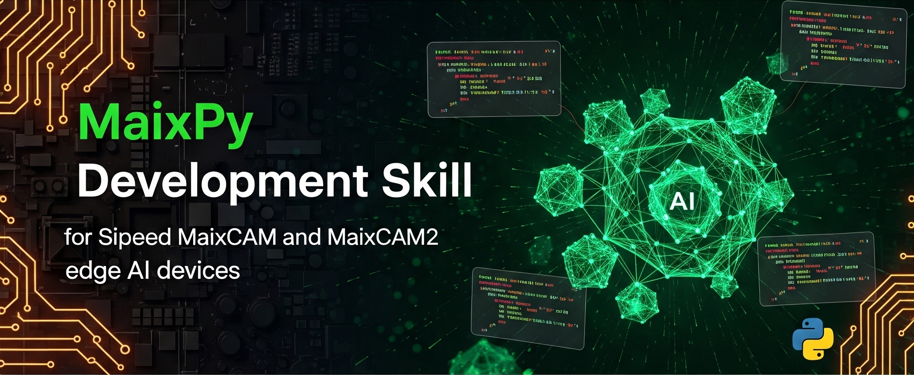

# MaixPy 开发技能

<div align="center">
  
</div>

[](LICENSE)
[](https://github.com/sipeed/MaixPy)
[](https://claude.ai/code)

**[English](README.md)** | **[简体中文](README_CN.md)**

一个全面的 Claude Code 技能包，用于在 Sipeed MaixCAM、MaixCAM-Pro 和 MaixCAM2 边缘 AI 设备上使用 MaixPy v4 开发 Python 应用程序。

## 功能特性

| 类别 | 内容 |
|------|------|
| **AI 视觉** | YOLO 检测/分割/姿态、分类、人脸识别、OCR |
| **图像处理** | 色块检测、边缘检测、二维码/条码、线条追踪 |
| **目标追踪** | ByteTracker 追踪器、计数、轨迹可视化 |
| **硬件外设** | 摄像头、显示屏、UART、I2C、SPI、GPIO、PWM、ADC、USB HID |
| **网络功能** | WiFi、HTTP 流、MQTT、WebSocket、RTSP/RTMP |
| **音频功能** | 播放、录制、TTS 语音合成、ASR 语音识别 |
| **大语言模型** | Qwen、DeepSeek、InternVL（仅 MaixCAM2） |
| **高级功能** | OpenCV 集成、视频编解码、自学习分类器、通信协议 |

## 支持的硬件

| 设备 | CPU | 内存 | NPU | 大模型支持 |
|------|-----|------|-----|------------|
| MaixCAM | 1GHz RISC-V | 256MB | 1Tops | 否 |
| MaixCAM-Pro | 1GHz RISC-V | 256MB | 1Tops | 否 |
| MaixCAM2 | 1.2GHz A53 x2 | 1GB/4GB | 3.2Tops | 是 |

## 安装方法

### 方法一：直接下载

下载 `maixpy-dev.skill` 文件，放置到 Claude Code 的技能目录：

```bash
# Claude Code 技能目录
~/.claude/skills/
```

### 方法二：克隆仓库

```bash
git clone https://github.com/StanleyChanH/MaixPy-skill.git
cd MaixPy-skill
```

## 使用方法

当你提到以下内容时，技能会自动激活：
- MaixPy 开发、MaixCAM/MaixCAM2
- Sipeed AI 开发、嵌入式 AI 视觉项目

## 参考文档

| 主题 | 文件 | 内容 |
|------|------|------|
| AI 模型 | [ai_models.md](maixpy-dev/references/ai_models.md) | YOLO、分类、人脸、OCR、姿态、分割 |
| 图像处理 | [image_processing.md](maixpy-dev/references/image_processing.md) | 绘图、色块、边缘、二维码、变换 |
| 外设 | [peripherals.md](maixpy-dev/references/peripherals.md) | UART、I2C、SPI、GPIO、PWM、ADC |
| 网络 | [network.md](maixpy-dev/references/network.md) | WiFi、HTTP、MQTT、WebSocket |
| 音频 | [audio.md](maixpy-dev/references/audio.md) | 播放、录制、TTS、ASR |
| LLM/VLM | [llm_vlm.md](maixpy-dev/references/llm_vlm.md) | Qwen、DeepSeek、InternVL |
| 追踪 | [tracking.md](maixpy-dev/references/tracking.md) | ByteTracker、计数、轨迹 |
| 模式 | [patterns.md](maixpy-dev/references/patterns.md) | 触摸按钮、多线程、状态机、国际化 |
| 高级 | [advanced.md](maixpy-dev/references/advanced.md) | OpenCV、视频、USB HID、RTSP、协议 |

## 快速入门

```python
from maix import camera, display, image, nn, app

detector = nn.YOLOv8(model="/root/models/yolov8n.mud", dual_buff=True)
cam = camera.Camera(detector.input_width(), detector.input_height(), detector.input_format())
disp = display.Display()

while not app.need_exit():
    img = cam.read()
    objs = detector.detect(img, conf_th=0.5, iou_th=0.45)
    for obj in objs:
        img.draw_rect(obj.x, obj.y, obj.w, obj.h, color=image.COLOR_RED)
        img.draw_string(obj.x, obj.y, f'{detector.labels[obj.class_id]}: {obj.score:.2f}')
    disp.show(img)
```

## 资源链接

- [MaixPy 官方文档](https://wiki.sipeed.com/maixpy/)
- [MaixPy API 参考](https://wiki.sipeed.com/maixpy/api/index.html)
- [MaixPy GitHub](https://github.com/sipeed/MaixPy)
- [MaixHub 在线训练](https://maixhub.com)
- [MaixVision IDE](https://wiki.sipeed.com/zh/maixvision)

## 社区

- QQ 群：862340358
- Telegram：[t.me/maixpy](https://t.me/maixpy)

## 参与贡献

欢迎参与贡献！请提交 Pull Request。

## 开源许可

本项目采用 MIT 许可证 - 详情请查看 [LICENSE](LICENSE)。

## 致谢

- [Sipeed](https://www.sipeed.com/) - MaixPy 和 MaixCAM 系列
- [MaixPy Project](https://github.com/sipeed/MaixPy) - 底层 SDK

---

**注意**：本技能是非官方社区项目。官方支持请参考 [MaixPy 文档](https://wiki.sipeed.com/maixpy/)。
